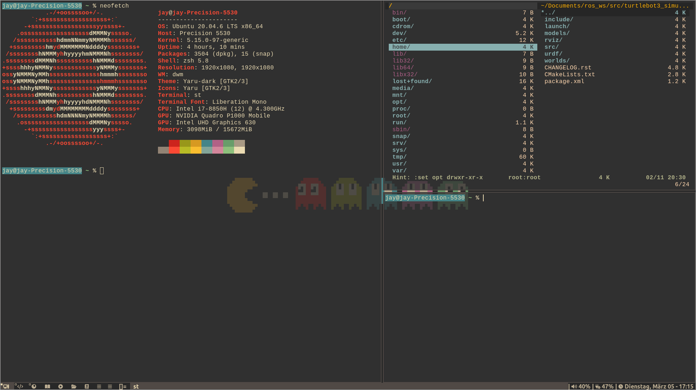
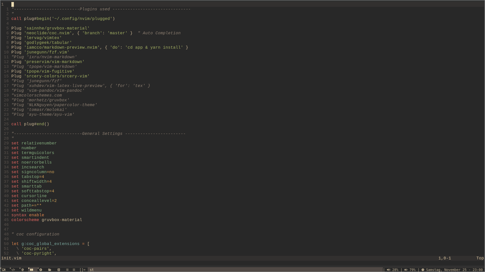

## Config Files

### dwm

Basic Autostart shell script `dwm/autostart.sh` to display time, volume and charging status of the machine.

#### Dependencies

`pacman -S dmenu zathura ttf-font-awesome vifm feh ttf-dejavu ttf-liberation tmux`

### Neovim

Plugins used with vim plug,

- sainnhe/gruvbox-material (Gruvbox theme)
- neoclide/coc.nvim (Language server)
- lervag/vimtex (Latex for vim)
- godlygeek/tabular (Auto align of tabulation)
- iamcco/markdown-preview.nvim (Markdown preview)
- ixru/nvim-markdown (Markdown)
- tpope/vim-fugitive (Git)

#### Dependencies

`pacman -S nodejs npm yarn`
