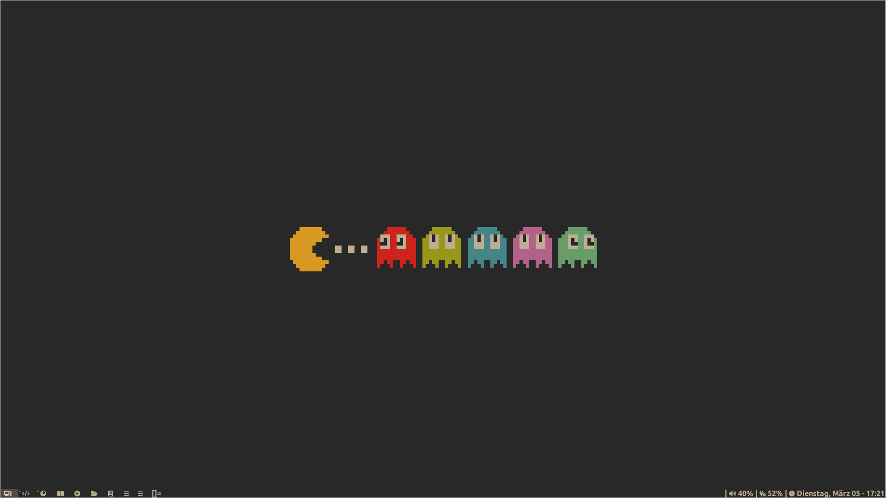

## Config Files

### dwm



Wallpapers from [Gruvbox Wallpapers](https://github.com/AngelJumbo/gruvbox-wallpapers) use the dynamic_wallpaper.sh in scripts to change wallpapers dynamically and a radom theme each time the computer starts.

#### Dependencies

`pacman -S dmenu picom zathura ttf-font-awesome vifm feh ttf-dejavu ttf-liberation tmux zsh thunar`

Install `pacman -S lxappearance` and `yay -S gruvbox-dark-gtk` to change thunar theme to gruvbox

### Neovim


Plugins used with vim plug,

- sainnhe/gruvbox-material (Gruvbox theme)
- neoclide/coc.nvim (Language server)
- lervag/vimtex (Latex for vim)
- godlygeek/tabular (Auto align of tabulation)
- iamcco/markdown-preview.nvim (Markdown preview)
- ixru/nvim-markdown (Markdown)
- tpope/vim-fugitive (Git)

#### Dependencies

`pacman -S nodejs npm yarn`

## Creating a desktop entry

- Create a dwm.desktop file at `/usr/share/xsessions/`
- Paste the following in the file
```conf
[Desktop Entry]
Encoding=UTF-8
Name=Dwm
Comment=Dynamic window manager
Exec=dwm
Icon=dwm
Type=XSession
```

- Change the file to executalble `chmod +x dwm.desktop`


## Setting up the touch pad

- Check if the directory exists `sudo mkdir -p /etc/X11/xorg.conf.d`

- Create a new file in the directory for touchpad  `sudo touch /etc/X11/xorg.conf.d/90-touchpad.conf`

Paste the following Config in the file

```conf
Section "InputClass"
        Identifier "touchpad"
        MatchIsTouchpad "on"
        Driver "libinput"
        Option "Tapping" "on"
        Option "TappingButtonMap" "lrm"
        Option "NaturalScrolling" "on"
        Option "ScrollMethod" "twofinger"
EndSection
```

